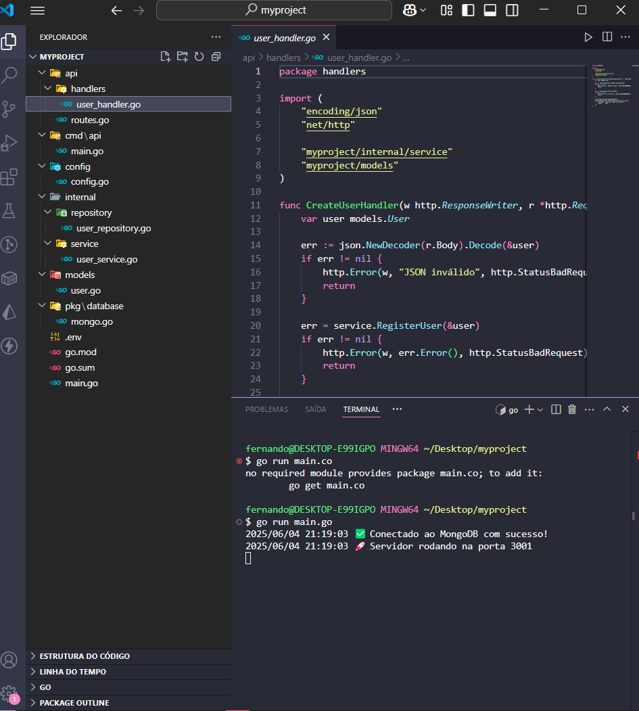
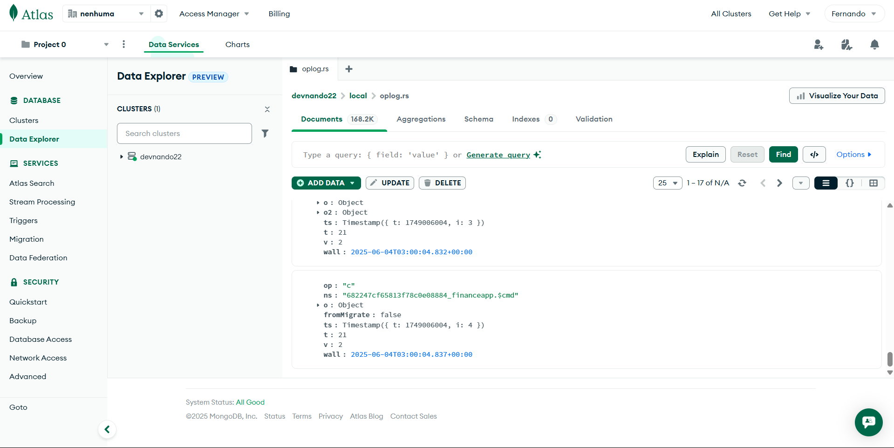

📄 README.md
markdown
Copiar código
# 🧩 Go-Projeto-Idiomatica

Projeto backend idiomático em Go utilizando arquitetura limpa com MongoDB, JWT, rotas desacopladas e boas práticas profissionais.

---




> Estrutura modular e escalável com `cmd/`, `internal/`, `pkg/`, `api/`, e integração com MongoDB Atlas.

---

## 🚀 Tecnologias Utilizadas

- [Golang 1.21+](https://golang.org)
- [MongoDB Atlas](https://www.mongodb.com/cloud/atlas)
- JWT Authentication
- Arquitetura Limpa (Clean Architecture)
- Modularização idiomática (`cmd`, `pkg`, `internal`)

---

## 📁 Estrutura do Projeto

```text
myproject/
├── cmd/              # Entrypoints (API, CLI, workers)
├── internal/         # Lógica de negócio privada
├── pkg/              # Pacotes reutilizáveis (Mongo, Auth, etc.)
├── api/              # Handlers e rotas HTTP
├── config/           # Leitura de variáveis de ambiente
├── models/           # Structs do domínio
├── tests/            # Testes automatizados
└── README.md
📦 Instalação
bash
Copiar código
git clone https://github.com/seuusuario/Go-Projeto-Idiomatica.git
cd Go-Projeto-Idiomatica
go mod tidy
go run ./cmd/api
Configure o arquivo .env com sua string do MongoDB:

ini
Copiar código
PORT=3001
DATABASE_URL="sua_mongodb_string"
🔐 Rota de Cadastro
http
Copiar código
POST /users
Content-Type: application/json

{
  "name": "Zw5",
  "email": "zw5@dev.com",
  "password": "123456"
}
Resposta:

json
Copiar código
{
  "message": "Usuário criado com sucesso",
  "user": {
    "id": "abc123...",
    "name": "Zw5",
    "email": "zw5@dev.com"
  }
}

🧪 Testes
bash
Copiar código
go test ./...
📌 To-do
 Cadastro de usuários

 Login com JWT

 Middleware de autenticação

 Testes automatizados

 Deploy com Docker

📃 Licença
MIT © Seu Nome